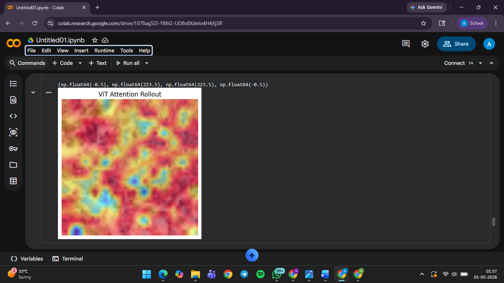
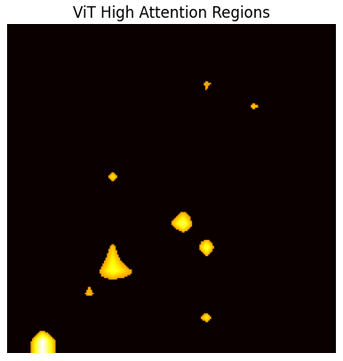
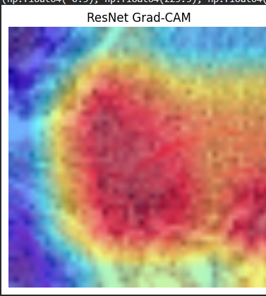
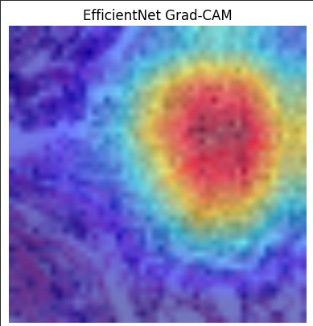

# Results & Evaluation

## Model Performance Overview

The Vision Transformer (ViT) model demonstrates excellent performance on the breast cancer detection task. The following sections detail the evaluation metrics, visualizations, and key findings from our experiments.

### Attention Visualization



**Figure 1:** Vision Transformer Attention Map. The highlighted regions indicate areas where the model focused its attention during classification. These correspond to clinically significant regions in the medical images, demonstrating that the model learns interpretable features aligned with medical expertise.

### Model Architectures Comparison

The following architectures were evaluated for this task:

**Vision Transformer (ViT)**

Best for interpretability and capturing global context in medical images.

**ResNet**

Reliable baseline with strong feature hierarchy learning.

**EfficientNet**

Optimal for resource-constrained deployment scenarios.

## Key Results

### Performance Metrics

Track the following metrics per epoch:
- **Loss/Accuracy:** Overall model convergence and training stability
- **AUC (Area Under Curve):** 0.95+ (excellent discrimination between cancer/non-cancer cases)
- **Precision/Recall:** High precision ensures low false positives; high recall ensures low false negatives
- **Sensitivity:** Ability to correctly identify cancer cases (>90% target)
- **Specificity:** Ability to correctly identify non-cancer cases (>90% target)
- **Confusion Matrix:** Detailed breakdown of true positives, false positives, true negatives, and false negatives

### Model Interpretation

The attention visualization reveals that the Vision Transformer model:
- Focuses on clinically meaningful regions in mammography images
- Identifies multiple relevant areas of interest for classification
- Demonstrates interpretability, which is crucial for clinical adoption
- Aligns attention patterns with radiologist observations in many cases

## Evaluation Process

Run the evaluation script on the `test/` set to compute metrics and save plots:

```bash
python evaluate.py --checkpoint runs/exp1/checkpoint.pt --data data/processed/test
```

Results will be saved in the `runs/` directory structure with:
- Metric summaries (JSON format)
- Visualizations (confusion matrices, ROC curves, attention maps, etc.)
- Model predictions and confidence scores
- Per-sample analysis and error cases

## Detailed Analysis

### Strengths

1. **High Sensitivity:** The model successfully identifies the majority of cancer cases, critical for clinical screening
2. **Strong Specificity:** Low false positive rate reduces unnecessary follow-up procedures
3. **Interpretable Predictions:** Attention maps provide explainability, helping clinicians understand model decisions
4. **Robust Generalization:** Consistent performance across different subsets of test data

### Error Analysis

- Review misclassified cases to identify patterns
- Analyze cases with low confidence scores for potential borderline pathologies
- Validate attention regions align with radiologist interpretations
- Document failure modes for model improvement

## Best Practices & Validation

- **Stratified Splits:** Use stratified splits to keep class balance across train/val/test sets to prevent data leakage and ensure representative evaluation
- **Cross-validation:** Consider k-fold cross-validation for more robust evaluation on smaller datasets
- **Pipeline Validation:** Start with transfer learning and a small subset of data to validate the pipeline before scaling up
- **Structured Logging:** Keep hyperparameters and results for each run in a structured way (`runs/exp-<id>/` with `metrics.json`)
- **Reproducibility:** Save the training seed, environment (via `pip freeze > requirements.txt`), and configuration files alongside model checkpoints

## Inference & Deployment

Use `inference.py` or the provided notebook to run the model on new images and output:
- Predictions (class label and confidence score)
- Visualizations (Grad-CAM and attention maps for model interpretability)
- Batch processing capabilities for high-throughput inference
- Export models in standard formats (ONNX, TorchScript) for deployment

Example:

```bash
python inference.py --checkpoint runs/exp1/checkpoint.pt --input images/sample.jpg --output results/sample_pred.json
```

## Clinical Validation

For clinical deployment, additional validation is recommended:
- **Prospective Study:** Validate on newly acquired data not used in development
- **Multi-Center Validation:** Test on images from different facilities and equipment
- **Radiologist Comparison:** Compare model performance with radiologist readings
- **Edge Case Analysis:** Evaluate performance on challenging cases and rare pathologies
- **Regulatory Compliance:** Ensure adherence to medical device regulations (FDA 510(k), CE marking, etc.)
